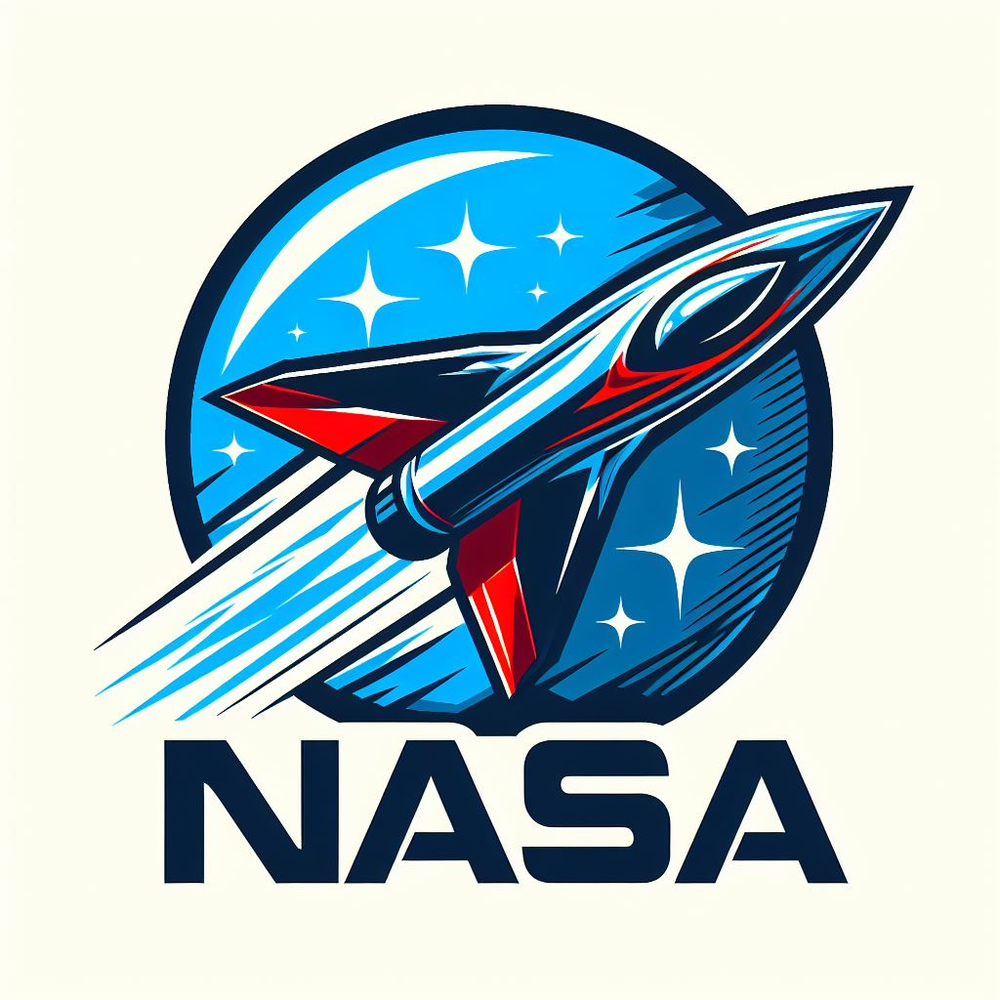

NASA (National Aeronautics and Space Administration)
=====

.. raw:: html

 

.. _Nasa:

   

Proposito
------------

Es la agencia del gobierno de los Estados Unidos responsable de la exploración espacial, la tecnología espacial, las ciencias de la Tierra y del espacio y la investigación aeronáutica de los Estados Unidos. La NASA inspira al mundo al explorar nuevas fronteras, descubrir nuevos conocimientos y desarrollar nuevas tecnologías [#]_.

Actualidad
------------

Actualmente se encuentra inmersa en una fase trascendental de su evolución histórica, caracterizada por la decidida aspiración de restaurar y consolidar su posición preeminente a nivel global en el ámbito aeroespacial. Con el firme propósito de materializar esta visión, la agencia ha emprendido la ejecución de cuatro :ref:`proyectos <proyectos>` de vanguardia, los cuales representan hitos cruciales en su agenda estratégica [#]_.

.. list-table::

    * - .. figure:: _static/nasa2.jpg

      - .. figure:: _static/nasa3.jpg

      - .. figure:: _static/nasa4.jpg

      - .. figure:: _static/nasa5.jpg
         
.. [#] This footnote is numbered automatically and anonymously using a
   label of "#" only.
.. [#] Para mas información de sus proyectos pueden dirigirse a: https://www.nasa.gov/nasa-missions/

